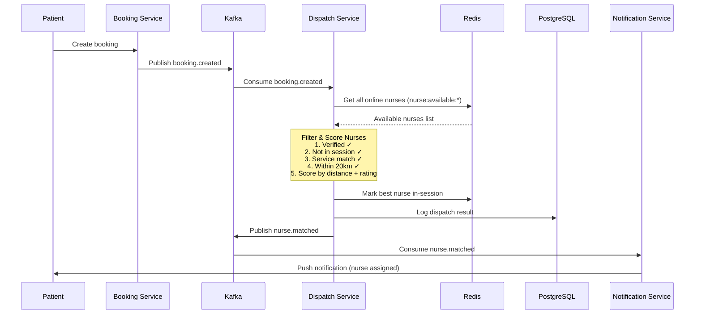
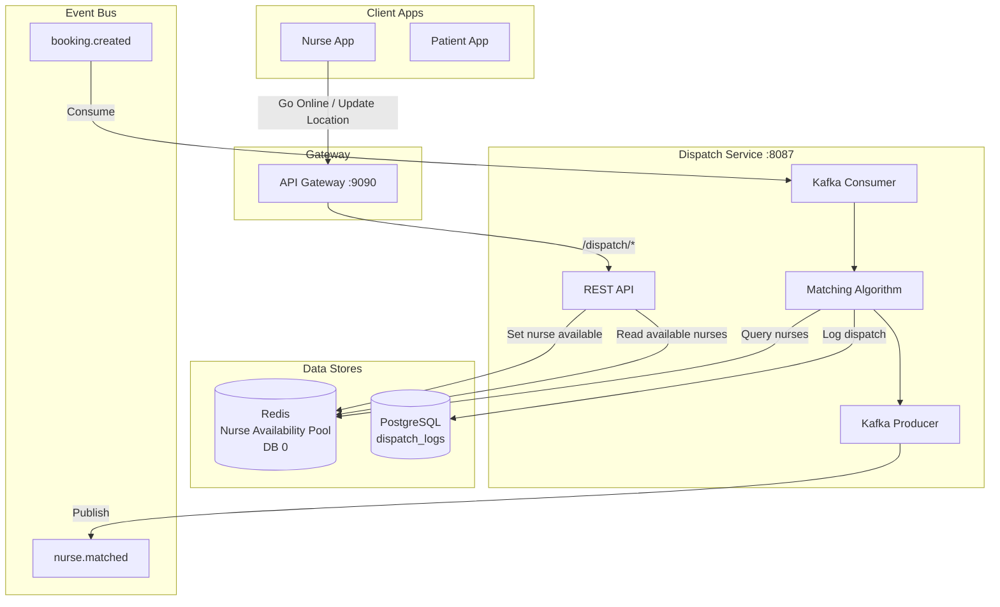
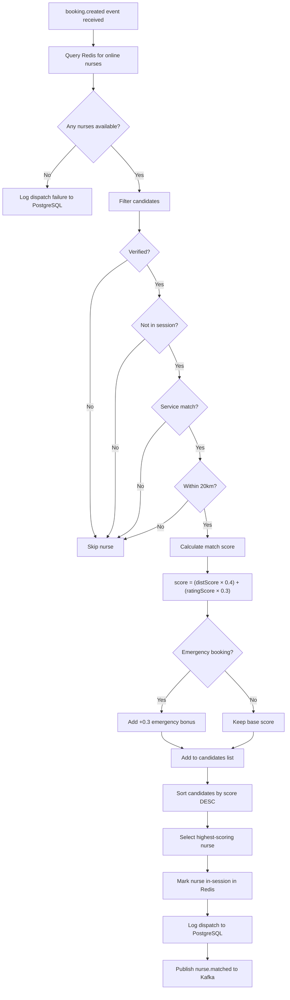

# NAKI Dispatch & Matching Service

Microservice responsible for automatically matching patients to the best available nurse when a booking is created. Uses Redis for real-time nurse availability tracking and Kafka for event-driven dispatch.

## How It Works

### The Dispatch Flow



### Architecture Overview



### Matching Algorithm Flow



### Step-by-Step

1. **Patient books a service** → Booking Service publishes a `booking.created` event to Kafka
2. **Dispatch Service picks it up** → Kafka consumer receives the event
3. **Queries Redis** for all online, verified, non-busy nurses
4. **Filters candidates** by service category match and 20km max distance
5. **Scores each nurse** using the matching algorithm (see below)
6. **Selects the highest-scoring nurse**
7. **Marks the nurse as in-session** in Redis (prevents double-booking)
8. **Publishes `nurse.matched` event** to Kafka with booking + nurse details
9. **Logs the dispatch** to PostgreSQL for audit history

If no nurse is found, the dispatch failure is logged with the reason (no nurses online, none within range, etc).

---

## Matching Algorithm

The algorithm scores each candidate nurse on a 0-1 scale:

```
score = (distanceScore × 0.4) + (ratingScore × 0.3) + (emergencyBonus)
```

### Scoring Breakdown

| Factor | Weight | How It's Calculated |
|--------|--------|---------------------|
| **Distance** | 40% | `1.0 - (distance / 20km)` — closer nurses score higher. Distance is calculated using the **Haversine formula** for accurate GPS-based earth-surface distance |
| **Rating** | 30% | `nurseRating / 5.0` — higher-rated nurses score higher (5.0 is max rating) |
| **Emergency Bonus** | 30% | Added only when `booking_type = "emergency"` — ensures emergency bookings always prioritize the closest available nurse |

### Filter Criteria (must pass ALL)

| Filter | Rule |
|--------|------|
| **Verification** | Nurse must be verified (`verified = true`) |
| **Session status** | Nurse must not be currently in a session (`in_session = false`) |
| **Service category** | If the booking specifies a service type, the nurse must offer that service |
| **Distance** | Nurse must be within **20km** of the patient's location |
| **Online status** | Nurse must be online (`is_online = true`) |

### Haversine Distance Formula

Used to calculate the real-world distance between two GPS coordinates on the Earth's surface:

```
a = sin²(Δlat/2) + cos(lat1) × cos(lat2) × sin²(Δlon/2)
c = 2 × atan2(√a, √(1−a))
distance = 6371km × c
```

This gives accurate distances in kilometers regardless of location, accounting for Earth's curvature.

### Example Match Scenario

Suppose a patient at `(5.6145, -0.2050)` requests a "home_care" service. Three nurses are online:

| Nurse | Distance | Rating | Services | Score |
|-------|----------|--------|----------|-------|
| Nurse A | 3.2km | 4.8 | home_care, wound_care | `(0.84 × 0.4) + (0.96 × 0.3) = 0.624` |
| Nurse B | 8.5km | 4.5 | home_care | `(0.575 × 0.4) + (0.90 × 0.3) = 0.500` |
| Nurse C | 2.1km | 3.2 | elderly_care | Filtered out (service mismatch) |

**Winner: Nurse A** with score `0.624` — she's close AND highly rated.

For an **emergency** booking, the same calculation adds `+0.3` bonus:
- Nurse A: `0.624 + 0.3 = 0.924`
- Nurse B: `0.500 + 0.3 = 0.800`

---

## Redis Data Store

All nurse availability data lives in Redis for fast lookups. No database queries during matching.

### Key Structure

```
nurse:available:{nurse_id}  →  JSON payload
```

### Stored Data

```json
{
  "nurse_id": "550e8400-e29b-41d4-a716-446655440000",
  "is_online": true,
  "latitude": 5.6145,
  "longitude": -0.2050,
  "services": ["home_care", "wound_care", "elderly_care"],
  "rating": 4.8,
  "verified": true,
  "in_session": false,
  "updated_at": "2026-06-20T10:30:00Z"
}
```

### TTL (Time-To-Live)

Each nurse key has a **30-minute TTL**. If the nurse app doesn't send a location update or heartbeat within 30 minutes, Redis automatically removes them from the available pool. This prevents stale nurses from being matched.

### Redis Operations

| Operation | What It Does |
|-----------|--------------|
| `SET nurse:available:{id}` | Nurse goes online — stores their location, services, rating |
| `DEL nurse:available:{id}` | Nurse goes offline — removed from pool |
| `GET nurse:available:{id}` | Read a specific nurse's data |
| `KEYS nurse:available:*` | Get all online nurses for matching |
| Update location | `GET` → modify lat/lng → `SET` back |
| Set in-session | `GET` → set `in_session: true` → `SET` back |

---

## Kafka Events

### Consumed Events

| Topic | Source | Purpose |
|-------|--------|---------|
| `booking.created` | Booking Service | Triggers auto-dispatch when a new booking is created |

#### `booking.created` Payload

```json
{
  "booking_id": "uuid",
  "customer_id": "uuid",
  "customer_name": "Kwame Mensah",
  "customer_phone": "+233541234567",
  "customer_email": "kwame@example.com",
  "service_type": "home_care",
  "booking_type": "scheduled",
  "scheduled_at": "2026-06-21T09:00:00Z",
  "address": "14 Oxford St, Osu, Accra",
  "latitude": 5.5571,
  "longitude": -0.1818,
  "status": "pending"
}

```

### Produced Events

| Topic | Destination | Purpose |
|-------|-------------|---------|
| `nurse.matched` | Notification Service, Booking Service | Notifies downstream services that a nurse has been assigned |

#### `nurse.matched` Payload

```json
{
  "booking_id": "uuid",
  "customer_id": "uuid",
  "nurse_id": "uuid",
  "customer_name": "Kwame Mensah",
  "customer_phone": "+233541234567",
  "service_type": "home_care",
  "scheduled_at": "2026-06-21T09:00:00Z",
  "address": "14 Oxford St, Osu, Accra",
  "distance_km": 3.24,
  "match_score": 0.6240
}
```

---

## API Endpoints

All endpoints require JWT authentication via the gateway. The gateway forwards `X-User-ID` and `X-User-Role` headers.

### Nurse Availability

These endpoints are called by the nurse mobile app.

#### `POST /api/v1/availability/online`
Nurse goes online and becomes available for bookings.

**Role required:** `nurse`

**Request body:**
```json
{
  "latitude": 5.6145,
  "longitude": -0.2050,
  "services": ["home_care", "wound_care"],
  "rating": 4.8
}
```

**Response:**
```json
{
  "status": 200,
  "message": "you are now online and available for bookings"
}
```

---

#### `POST /api/v1/availability/offline`
Nurse goes offline and is removed from the matching pool.

**Role required:** `nurse`

**No request body needed.**

**Response:**
```json
{
  "status": 200,
  "message": "you are now offline"
}
```

---

#### `PUT /api/v1/availability/location`
Updates the nurse's GPS coordinates in Redis. Called periodically by the nurse app while online.

**Role required:** `nurse`

**Request body:**
```json
{
  "latitude": 5.6200,
  "longitude": -0.1980
}
```

**Response:**
```json
{
  "status": 200,
  "message": "location updated"
}
```

---

### Dispatch Management

#### `GET /api/v1/dispatch/nurses`
Lists all currently available nurses in the Redis pool.

**Role required:** `nurse`, `super_admin`

**Response:**
```json
{
  "status": 200,
  "message": "available nurses retrieved",
  "data": [
    {
      "nurse_id": "550e8400-e29b-41d4-a716-446655440000",
      "is_online": true,
      "latitude": 5.6145,
      "longitude": -0.2050,
      "services": ["home_care", "wound_care"],
      "rating": 4.8,
      "verified": true,
      "in_session": false,
      "updated_at": "2026-06-20T10:30:00Z"
    }
  ],
  "count": 1
}
```

---

#### `POST /api/v1/dispatch/match`
Manually trigger the matching algorithm for a booking. Useful for admin re-dispatch if the first match fails or is rejected.

**Role required:** `super_admin`

**Request body:** Same as `booking.created` event payload (see Kafka section above)

**Response:**
```json
{
  "status": 200,
  "message": "nurse matched",
  "data": {
    "nurse_id": "550e8400-e29b-41d4-a716-446655440000",
    "distance_km": 3.24,
    "rating": 4.8,
    "match_score": 0.6240
  }
}
```

---

#### `GET /api/v1/dispatch/history/:booking_id`
Get all dispatch attempts for a specific booking (matched + failed).

**Role required:** `nurse`, `customer`, `super_admin`

**Response:**
```json
{
  "status": 200,
  "message": "dispatch history retrieved",
  "data": [
    {
      "id": "uuid",
      "booking_id": "uuid",
      "nurse_id": "uuid",
      "status": "matched",
      "reason": "auto-matched: distance=3.24km rating=4.8 score=0.6240",
      "distance": 3.24,
      "match_score": 0.6240,
      "booking_type": "scheduled",
      "created_at": "2026-06-20T10:35:00Z"
    }
  ]
}
```

---

#### `GET /api/v1/dispatch/recent`
Get the 50 most recent dispatch logs across all bookings. Admin dashboard use.

**Role required:** `super_admin`

**Response:** Same structure as dispatch history, but across all bookings.

---

## Database Schema

### `dispatch_logs` Table

Stores every dispatch attempt for audit and debugging.

```sql
CREATE TABLE dispatch_logs (
    id           UUID PRIMARY KEY DEFAULT uuid_generate_v4(),
    booking_id   UUID NOT NULL,
    nurse_id     UUID,                          -- NULL if dispatch failed
    status       VARCHAR(50) DEFAULT 'pending', -- 'matched' | 'failed'
    reason       TEXT DEFAULT '',                -- Human-readable explanation
    distance     DECIMAL(10,2) DEFAULT 0,       -- km to patient
    match_score  DECIMAL(10,4) DEFAULT 0,       -- 0-1 algorithm score
    booking_type VARCHAR(50) DEFAULT 'scheduled',
    created_at   TIMESTAMPTZ DEFAULT NOW()
);
```

**Indexes:** `booking_id`, `nurse_id`, `status` — for fast lookups.

---

## Project Structure

```
naki-dispatch-service/
├── main.go                              # Entry point — init DB, Redis, Kafka, start server
├── conf/
│   └── config.go                        # Environment config loader
├── controllers/
│   └── dispatch.go                      # HTTP handlers for all endpoints
├── database/
│   ├── db.go                            # PostgreSQL connection + migration runner
│   └── migrations/
│       └── 001_create_dispatch_logs.sql # Initial schema
├── functions/
│   └── api_functions/
│       ├── matcher.go                   # Matching algorithm + haversine + scoring
│       ├── redis_store.go               # Redis CRUD for nurse availability
│       ├── kafka_consumer.go            # booking.created listener + dispatch handler
│       └── kafka_producer.go            # nurse.matched event publisher
├── models/
│   └── dispatch.go                      # Data structures (NurseAvailability, DispatchLog, etc)
├── routers/
│   └── router.go                        # Gin route definitions + role middleware
├── transport/
│   └── middlewares/
│       └── auth.go                      # JWT + X-User-ID header auth middleware
├── Dockerfile                           # Multi-stage build (Go 1.23 → Alpine)
├── .env.example                         # Required environment variables
├── go.mod
└── go.sum
```

---

## Infrastructure

### Dependencies

| Service | Purpose | Container |
|---------|---------|-----------|
| **PostgreSQL 16** | Dispatch logs (audit history) | `dispatch_postgres` |
| **Redis 7** | Real-time nurse availability pool | `naki_redis` |
| **Kafka** | Event bus for booking.created / nurse.matched | `naki_kafka` |

### Docker Compose

The service is defined in the root `docker-compose.yml`:

```yaml
dispatch:
  build: ./naki-dispatch-service
  container_name: naki_dispatch
  depends_on:
    dispatch-postgres:
      condition: service_healthy
    redis:
      condition: service_started
    kafka:
      condition: service_started
  environment:
    PORT: 8087
    DB_HOST: dispatch-postgres
    DB_PORT: 5432
    DB_USER: postgres
    DB_PASSWORD: postgres
    DB_NAME: naki_dispatch
    REDIS_ADDR: redis:6379
    KAFKA_BROKER: kafka:9092
    JWT_SECRET: ${JWT_SECRET}
```

### Gateway Routing


---

## Environment Variables

| Variable | Default | Description |
|----------|---------|-------------|
| `PORT` | `8087` | HTTP server port |
| `DB_HOST` | `localhost` | PostgreSQL host |
| `DB_PORT` | `5432` | PostgreSQL port |
| `DB_USER` | `postgres` | PostgreSQL user |
| `DB_PASSWORD` | — | PostgreSQL password |
| `DB_NAME` | `naki_dispatch` | PostgreSQL database name |
| `DB_SSLMODE` | `disable` | PostgreSQL SSL mode |
| `REDIS_ADDR` | `redis:6379` | Redis address |
| `REDIS_PASSWORD` | — | Redis password (empty if no auth) |
| `KAFKA_BROKER` | `kafka:9092` | Kafka broker address |
| `JWT_SECRET` | — | JWT signing secret (shared across services) |

---

## Running Locally

```bash
# 1. Clone the repo
git clone https://github.com/bedriftenconsulting/naki-dispatch-service.git
cd naki-dispatch-service

# 2. Copy env
cp .env.example .env
# Edit .env with your values

# 3. Start dependencies (PostgreSQL, Redis, Kafka)
# These should be running via docker-compose

# 4. Run the service
go run main.go
```

---

## How the Nurse App Integrates

1. **Nurse opens the app and taps "Go Online"**
   - App sends `POST /dispatch/api/v1/availability/online` with GPS + service list
   - Dispatch service stores the nurse in Redis

2. **While online, app sends location updates every 30 seconds**
   - App sends `PUT /dispatch/api/v1/availability/location` with new GPS
   - Dispatch service updates Redis entry + resets TTL

3. **Patient creates a booking**
   - Booking service publishes `booking.created` to Kafka
   - Dispatch service automatically picks up the event
   - Runs matching algorithm → finds best nurse
   - Publishes `nurse.matched` → notification service sends push to nurse

4. **Nurse accepts the booking**
   - Nurse is marked `in_session: true` in Redis
   - No more bookings dispatched to this nurse until session ends

5. **Nurse finishes the visit**
   - Booking service publishes completion event
   - Nurse can be set back to `in_session: false`

6. **Nurse taps "Go Offline"**
   - App sends `POST /dispatch/api/v1/availability/offline`
   - Redis key is deleted — nurse disappears from pool
